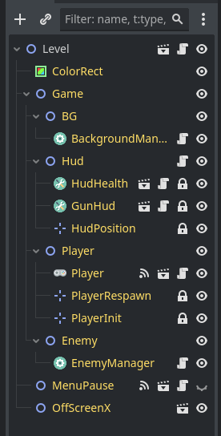
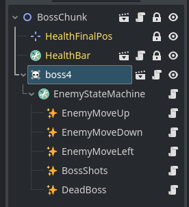
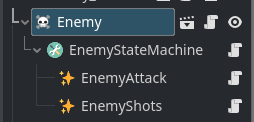

# Manual de Space Umpact

Estructura del directorio

```text
.
├── assets
│   ├── fonts
│   ├── icons
│   ├── music
│   └── sfx
├── control
│   └── theme
├── entities
├── global
├── levels
│   ├── level_1
│   ├── level_2
│   └── level_3
├── scenes
│   ├── enemies
│   ├── music
│   ├── sfx
│   └── utilities
├── scripts
│   ├── control
│   ├── enemy
│   ├── player
│   ├── state
│   └── utils
├── temp
└── test
```

## Pasos para crear un nivel

#### Instanciar la escena _level_.

- Presione <kbd>Ctrl+Shift+A</kbd> y seleccione `res://entities/level.tscn` luego guardar en su respectiva carpeta `res://scenes/level_numero.tscn`.

> <span style='color: #ffcc32'>⚠️ __IMPORTANTE:__ Renombar en nodo con el formato `Level-1`.</span>

Notaras que ya están instaciado con algunos componentes.



#### Crear un elemento _BG_.

1. Crear un **TileMap** y asignarle el script `res://scripts/utils/map_chunk.gd` posteriormente guárdalo en `res://levels/level_numero/nombre.tscn`.
2. Luego de tener al menos dos _TileMap_ desde ahora llamado <mark>MapChunk</mark>, en la escena del nivel, instanciar como hijo de <u style="color:#f989c7">BackgroundManager</u>.
3. Posteriormente haga clic sobre <u style="color:#f989c7">BackgroundManager</u> y agregue los <mark>MapChunk</mark> al array de **List Map** en el inspector.

> <span style='color: #ffcc32'>⚠️ **IMPORTANTE:** Escalar 2x el TileMap.</span>

#### Agregando [_enemigos_](#crear-un-enemigo "Guía para hacer un enemigo")

- Instancia `res://scenes/music/game_music.tscn` y `res://scenes/music/boss_music.tscn` como hijo de <u style="color:#f989c7">EnemyManager</u>.
- Haga clic en <u style="color:#f989c7">EnemyManager</u> y dirigirse al inspector luego agregue en el array de **Game Music** los elementos.
- Agregue los **Enemy Chunk** a su respectivo array en el inspector.
- Agregue la escena de **Boss Chunk** en el inspector.

#### Creando un _Enemy Chunk_

- Presione <kbd>Ctrl+Shift+A</kbd> y seleccione `res://entities/enemy_chunk.tscn`, luego guárdalo en `res://levels/level_numero/enemy_chunk_numero.tscn`.
- Empiece a instanciar a los [enemigos](#crear-un-enemigo "Guía para hacer un enemigo").

> <span style='color: #92cff4'>📑 NOTA: Aquí configurar el [State machine](#state-machine "Guía para hacer un FSM") individualmente si lo requiere.</span>

#### Creando el _Boss Chunk_

- Presione <kbd>Ctrl+Shift+A</kbd> y seleccione `res://entities/boss_chunk.tscn`, luego guárdalo en `res://levels/level_numero/boss_chunk.tscn`.
- Instanciar al [Boss](#crear-boss "Guía para hacer un Boss").
- Presione <kbd>Ctrl+A</kbd> y busca el nodo <u style="color:#f989c7">EnemyStateMachine</u> y agregue como hijo los **State** necesarios.



- Empiece conectando los _state_ en el inspector.

#### Asignar un State {#set-state-machine}

Haga clic en cualquier enemigo y dirigase al inspector, busque la propieda **State**, ahí se asignaran los _estados_. Antes de empezar comienze instaciando el nodo <u style="color:#f989c7">EnemyStateMachine</u>.

Para este ejemplo se usara un estado simple de disparo.

> <span style='color: #ffcc32'>⚠️ **IMPORTANTE:** Marcar _Can Shoot_ ☑️ on.</span>

- Haga clic sobre <u style="color:#f989c7">EnemyStateMachine</u> y presione <kbd>Ctrl+A</kbd> para instanciar los siguientes nodos:
  - <u style="color:#f989c7">EnemyAttack</u>
  - <u style="color:#f989c7">EnemyShots</u>



Ahora toca conectar los _states_

- En el _enemy_ asignar **FSM** a <u style="color:#f989c7">EnemyStateMachine</u>.
- En <u style="color:#f989c7">EnemyStateMachine</u> su propiedad **State** asignar un estado que sera el inicial.

## Pasos para crear un Enemigo {#crear-un-enemigo}

1. Presione <kbd>Ctrl+Shift+A</kbd> y seleccione `res://entities/actors.tscn` y guardalo en `res://scenes/enemies/enemigo_numero.tscn`.
2. Configure el sprite y las colisiones.
3. Adjunte el script `res://scripts/enemy/enemy.gd`.
   - Configure las propiedades en el inspector.
   - Haga clic en _Explotion Scene_ y seleccione `res://scenes/utils/explotion_scene.tscn`.
4. Presione <kbd>Ctrl+A</kbd> y busca los siguientes componentes:
   - <u style="color:#f989c7">EnemyHitBox</u>
   - <u style="color:#f989c7">EnemyHealthBox</u>
5. Duplique la colision dos veces y arrastre una para cada componente.
6. Haga clic en <u style="color:#f989c7">EnemyHitBox</u> y en el inspector configure su _collision_ de la siguiente manera:
   - **Layer** sin asignar.
   - **Mask** asignar a la capa de <mark>player</mark>.
7. Haga clic en <u style="color:#f989c7">EnemyHealthBox</u> y en el inspector configure su _collision_ de la siguiente manera:
   - **Layer** asigna a la capa de <mark>enemy</mark>.
   - **Mask** sin asignar.
8. Adicionalmente en <u style="color:#f989c7">EnemyHealthBox</u> instancia la escena `res://scenes/sfx/hit_sfx.tscn` y asignarlo en el inspector a **Hit Sound**.
9. Por ultimo agrega el node <u style="color:#f989c7">Destroyer</u> y confugure su _collision_ de la siguiente manera:
	- **Layer** asigna a la capa de <mark>destroyer_x_left</mark>.
	- **Mask** <mark>off_x_left</mark>.

> <span style='color:#ffcc32'>⚠️ **IMPORTANTE:** Escalar 2x el sprite.</span>

> <span style='color: rgb(88, 191, 212)'>🛈 **INFO:** No configure aquí el [State](#set-state-machine "Guía para hacer un FSM").</span>

## Pasoso para crear un _Boss_ {#crear-boss}

1. Presione <kbd>Ctrl+Shift+A</kbd> y seleccione `res://entities/boss.tscn` y guardalo en `res://scenes/enemies/boss_numero.tscn`.
2. Configure el sprite y las colisiones.

> <span style='color:#ffcc32'>⚠️ **IMPORTANTE:** Escalar 2x el sprite.</span>