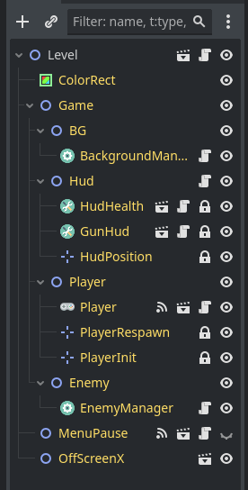

# Manual de Space Umpact

Estructura del directorio
```text
.
├── assets
│   ├── fonts
│   ├── icons
│   ├── music
│   └── sfx
├── control
│   └── theme
├── entities
├── global
├── levels
│   ├── level_1
│   ├── level_2
│   └── level_3
├── scenes
│   ├── enemies
│   ├── music
│   ├── sfx
│   └── utilities
├── scripts
│   ├── control
│   ├── enemy
│   ├── player
│   ├── state
│   └── utils
├── temp
└── test
```

## Pasos para crear un nivel

#### Instanciar la escena *level*.

- Presione <kbd>Ctrl+Shift+A</kbd> y seleccione `res://entities/level.tscn` luego guardar en su respectiva carpeta `res://scenes/level_numero.tscn`.

> Notaras que ya están instaciado con algunos componentes.

> 

#### Crear un  elemento *BG*.

- Crear un **TileMap** y asignarle el script `res://scripts/utils/map_chunk.gd` posteriormente guárdalo en `res://levels/level_numero/nombre.tscn`.
- Luego de tener al menos dos *TileMap* desde ahora llamado <mark>MapChunk</mark>, en la escena del nivel, instanciar como hijo de <u style="color:#f989c7">BackgroundManager</u>.
- Posteriormente haga clic sobre <u style="color:#f989c7">BackgroundManager</u> y agregue los <mark>MapChunk</mark> al array de **List Map** en el inspector.

#### Agregando [enemigos](#crear-un-enemigo 'Guía para hacer un enemigo')

- Instancia `res://scenes/music/game_music.tscn` y `res://scenes/music/boss_music.tscn` como hijo de <u style="color:#f989c7">EnemyManager</u>.
- Haga clic en <u style="color:#f989c7">EnemyManager</u> y dirigirse al inspector luego agregue en el array de *Game Music* los elementos.

#### Agregando un **Enemy Chunk**

- Presione <kbd>Ctrl+Shift+A</kbd> y seleccione `res://entities/enemy_chunk.tscn`, luego guárdalo en `res://levels/level_numero/enemy_chunk_numero.tscn`.
- Empiece a instanciar a los [enemigos](#crear-un-enemigo 'Guía para hacer un enemigo').

## Pasos para crear un Enemigo {#crear-un-enemigo}

- Presione <kbd>Ctrl+Shift+A</kbd> y seleccione `res://entities/actors.tscn` y guardalo en `res://scenes/enemies/enemigo_numero.tscn`.
- Configure el sprite y las colisiones.
- Adjunte el script `res://scripts/enemy/enemy.gd`.
	- Configure las propiedades en el inspector.
	- Haga clic en *Explotion Scene* y seleccione `res://scenes/utils/explotion_scene.tscn`.
- Presione <kbd>Ctrl+A</kbd> y busca los siguientes componentes:
	- <u style="color:#f989c7">EnemyHitBox</u>
	- <u style="color:#f989c7">EnemyHealthBox</u>
- Duplique la colision dos veces y arrastre una para cada componente.


> <span style='color: #ffcc32'>⚠️ **IMPORTANTE:** Escalar 2x el sprite.</span>

> <span style='color: rgb(88, 191, 212)'>🛈  **INFO:** No configure aquí el *State*.</span>


